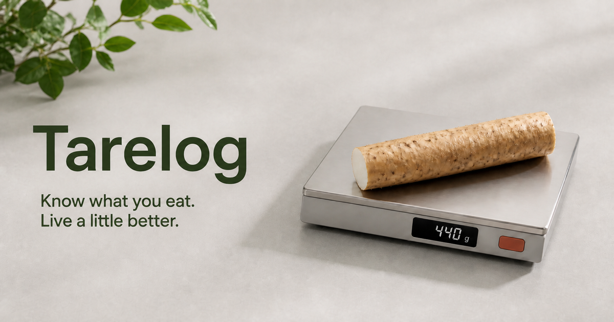

# Tarelog

**Know what you eat. Live a little better.**

Tarelog is a private, self-hosted food journal. It helps you record energy, macronutrients, and several additional nutrition fields, then look for patterns over time. It cannot determine whether your whole diet is nutritionally complete.

```text
photo or note → check the name, amount, and source → confirm → save the meal
```

For an ingredient photo, the model copies the visible name and scale reading; Tarelog then tries a sourced local entry or a structured USDA FoodData Central Foundation/SR Legacy match. For a package photo, it uses the visible nutrition label first and clearly marks any missing fields filled from a generic food reference. It does not identify a branded product in USDA.

Photos are sent to the vision provider configured by the deployer but are not stored by Tarelog. Recognition results and meals are written to D1 only after confirmation. Every saved value remains editable and keeps its source label.

## Run Tarelog

Requires Node.js 22.13 or later.

```bash
git clone https://github.com/zhangboy03/tarelog.git
cd tarelog
npm install
cp .dev.vars.example .dev.vars
npm run dev
```

Replace `APP_ACCESS_TOKEN` in `.dev.vars`, then open `http://localhost:3000/journal`. Photo recognition is optional. The included integration targets Alibaba Cloud DashScope's OpenAI-compatible endpoint with a non-thinking multimodal model and structured JSON output. Adapting another provider may require request changes.

## Personalise a deployment

Nothing in a fresh checkout contains the maintainer's targets or frequent foods. Configure your own values in the deployment environment:

- `APP_TIME_ZONE`
- `TARGET_KCAL`, `TARGET_PROTEIN`, `TARGET_CARBS`, `TARGET_FAT` — leave all four blank to show totals without goal rings
- `QUICK_LOG_ITEMS_JSON` — optional array of your own confirmed frequent foods

Do not copy another person's targets. Decide them for your own needs, and use professional help when health conditions make nutrition decisions high stakes.

Tarelog has no analytics or advertising trackers by default. The journal and every data route require the deployment's access token.

[Deploy](docs/DEPLOYMENT.md) · [Privacy](docs/PRIVACY.md) · [Apple Health](docs/APPLE_HEALTH.md) · [Contribute](CONTRIBUTING.md) · [MIT](LICENSE)

Tarelog is a logging tool, not a medical device or a substitute for professional advice.
